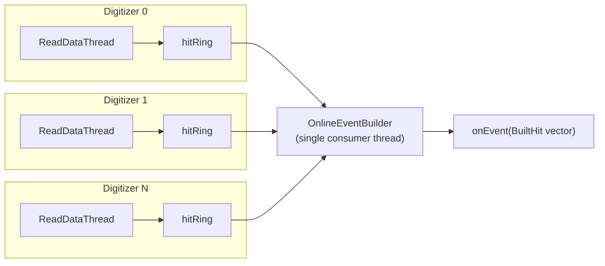
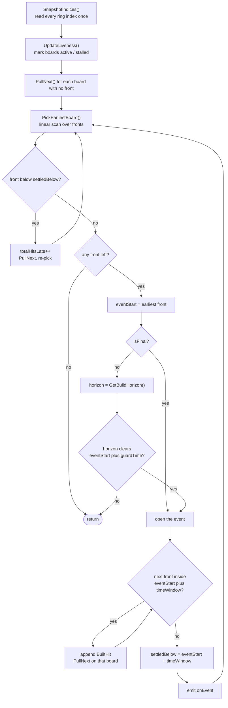

# SOLARIS DAQ

Data acquisition system for the SOLARIS (SOLenoid And Resonance Ionization Spectroscopy) detector at FRIB, using CAEN x2730 series digitizers (VX2740, VX2745, VX2730) with DPP-PHA and DPP-PSD firmware.

## Architecture

The core digitizer control classes are independent from the Qt UI classes.

### Core Classes

| File | Description |
|------|-------------|
| ClassDigitizer2Gen.h/cpp | Digitizer control: connection, configuration, data readout, file I/O |
| Hit.h | Event data structure for decoded hits |
| LeanHit.h | 16-byte timestamped hit used by the online event builder |
| OnlineEventBuilder.h/cpp | Online event builder: merges the per-board hit rings into time-correlated events |
| RawDecoder.h | Decoder for raw endpoint binary blob into individual hits |
| DigiParameters.h | Register definitions for DPP-PHA and DPP-PSD firmware |
| RingBuffer.h | Lock-free single-producer / multi-consumer circular buffer |

### UI Classes (Qt6)

| File | Description |
|------|-------------|
| main.cpp | Application entry point |
| mainwindow.h/cpp | Main window: digitizer management, run control, scaler display |
| digiSettingsPanel.h/cpp | Register editing panel for board and channel settings |
| scope.h/cpp | Oscilloscope for waveform display |
| SingleSpectra.h/cpp | Per-channel energy spectra (1D histograms) |
| SOLARISpanel.h/cpp | SOLARIS-specific detector mapping and configuration |
| CustomThreads.h | ReadDataThread and TimingThread for async acquisition |
| CustomWidgets.h | Custom Qt widgets (RComboBox, etc.) |
| Histogram1D.h / Histogram2D.h | Histogram classes using QCustomPlot |
| qcustomplot.h/cpp | QCustomPlot plotting library |
| macro.h | Global constants and macros |

### Auxiliary Tools (Aux/)

| File | Description |
|------|-------------|
| EventBuilder.cpp | Offline event builder: merges .sol files, builds time-correlated events, outputs ROOT trees |
| testOnlineBuilder.cpp | Verifies OnlineEventBuilder without hardware: self-test, synthetic data, .sol replay |
| SolReader.h | Reader for .sol binary data files |
| test.cpp | Comprehensive register and raw data decode tests |
| debug_raw.cpp | Dumps raw blob word contents and decoded hits for debugging |
| check_gate.cpp | Tests GateOffsetT read/write on the digitizer |

### Other

| File | Description |
|------|-------------|
| ClassInfluxDB.h/cpp | InfluxDB client for scaler rate logging |
| ClassElog.h/cpp | Wrapper around the `elog` command line client |
| ClassElogTemplate.h/cpp | Renders the elog entry from the user editable `elog.template` |

## Data Formats

The digitizer supports multiple readout formats, selected via `SetDataFormat()`:

| Format | ID | Description |
|--------|----|-------------|
| ALL | 0x00 | All metadata + 2 analog probes + 4 digital probes |
| OneTrace | 0x01 | 1 analog probe + energy/timestamp/flags |
| NoTrace | 0x02 | Energy/timestamp/flags, no waveforms |
| Minimum | 0x03 | Channel/energy/timestamp only |
| MiniWithFineTime | 0x04 | Channel/energy/timestamp/fine_timestamp |
| Raw | 0x0A | Raw binary blob from digitizer, decoded in software via RawDecoder |

### Raw Mode

Raw mode reads from the `/endpoint/raw` endpoint, which returns many events per TCP transaction (vs. one event per call for decoded endpoints). The `RawDecoder` class unpacks the big-endian 64-bit word stream into individual hits, supporting:

- Normal 2-word events (channel, timestamp, energy, energy_short, fine_timestamp, flags)
- Single-word events (EnDataReduction mode)
- Waveform events (analog/digital probe data)
- Time/counter statistics events (for scaler display without extra TCP overhead)
- Start/Stop Run special events

**Status:** The raw decoding has been tested and verified against the decoded endpoint on VX2730 DPP-PSD (firmware 2025052203). Decoded channel, energy, timestamp, and fine_timestamp values match the decoded endpoint output. The `.sol` file round-trip (write then read back via SolReader) is also verified.

However, the saving/acquisition pipeline for Raw mode is **not yet fully optimized or enabled in the GUI**. The current implementation yields one decoded hit per `ReadData()` call (to preserve the existing `ReadDataThread` loop contract), which limits throughput to roughly the same as the decoded endpoint. To achieve higher throughput, the pipeline needs to be restructured to save entire decoded blobs in batch. Raw mode is not yet selectable from the GUI data format dropdown.

## Online Event Building

`OnlineEventBuilder` groups hits from all digitizers into time-correlated events while the run is
in progress. It is plain C++ — no Qt, no CAEN_FELib, no ROOT — so the same class can be driven from
the GUI, from a console tool replaying a file, or from a separate analyzer process.

### Data flow



Each digitizer owns **one** `RingBuffer<LeanHit, 262144>` — 4 MiB, roughly 262 ms of a 1 MHz board.
It is written only by that board's `ReadDataThread`, preserving the single-producer contract in
`RingBuffer.h`, and read only by the builder.

One ring per **board**, not per channel, because a board already emits all of its channels
interleaved in timestamp order (see `format_RAW.md`, Aggregate Header). Splitting per channel would
buy nothing and turn a 4-way merge into a 256-way one. `ringBuffer[]` (per-channel energies, for
`SingleSpectra`) and `traceRingBuffer` (for the scope) are unchanged and still filled alongside.

### The build horizon

The core problem: when is it safe to close an event? If you emit an event at t=500 and a slower
board then delivers its hit at t=520, you have silently turned a coincidence into two singles.

Because each board emits in non-decreasing time order, once a board has delivered a hit at time
`t` it can never deliver anything earlier. So the minimum, over boards, of *the newest timestamp
each has delivered* is a floor under every hit still to come:

```
board 0 has delivered up to  t = 1000
board 1 has delivered up to  t = 1500
board 2 has delivered up to  t =  900   <-- the slowest board sets the limit
                                  ----
                build horizon =   900
```

An event is final only once its whole window sits below the build horizon, plus `guardTime` of
margin.
Two cases need care:

- **A board that has delivered nothing yet** has an *unknown* floor, not an absent one, so the
  horizon is forced to 0 and nothing is built until it speaks. Skipping such a board (as the
  offline builder can safely do, since a file with no data never gets any) lets the horizon run
  ahead and every hit that board later delivers arrives too late.
- **A board that stops delivering** would otherwise pin the horizon forever. After
  `stallTimeout` of no new data it is dropped from the minimum and building resumes. This is the
  one place data can be lost: a hit the board later delivers below an already-settled boundary is
  counted in `totalHitsLate` and discarded.

### Algorithm



The seed hit always joins its own event; later hits join while
`timestamp - eventStart < timeWindow`. The bound is **exclusive**, matching `Aux/EventBuilder`, so
the two builders agree hit for hit. `timeWindow = 0` means no event building: one hit per event.

The merge is a linear scan over one lookahead hit per board, not a priority queue. With at most 20
boards a scan is both faster and simpler — a heap needs side state tracking which sources are
currently in it, and that state has to be re-synchronised every time a board runs dry and refills,
which online is the normal case. `PickEarliestBoard()` is the only place that would change if the
board count ever grew enough to justify a heap.

### Reading one hit: `PullNext()`

1. Stop if the cursor has reached this pass's snapshot index.
2. Copy the slot, then **re-read the write index**. If the producer advanced by `size()` or more,
   the copy may be torn: skip forward to the oldest intact slot, add the skipped hits to
   `totalHitsDropped`, and retry. A `LeanHit` is 16 bytes and cannot be copied atomically, so this
   check is per copy, not once per drain.
3. Compare against that board's previous timestamp. A backwards step larger than `timeJump` is
   treated as the board's clock restarting and re-anchors the builder; a smaller one increments
   `monotonicityViolations`.

### Parameters

| Setter | Default | Meaning |
|--------|---------|---------|
| `SetTimeWindow(ns)` | 100 | Hits within this of the seed join the event. Exclusive bound. 0 = one hit per event. |
| `SetGuardTime(ns)` | 1000 | Extra margin beyond the window before an event is final. Clamped to at least `timeWindow`. More margin = more latency, more tolerance to jitter between boards. |
| `SetTimeJump(ns)` | 1e8 | A hit this far *below* the previous one from the same board means the clock restarted, not corruption. |
| `SetStallTimeout(ms)` | 500 | Wall-clock, not timestamps. A board whose ring has not advanced for this long is dropped from the build horizon. Must exceed the longest gap you expect between deliveries from your slowest board. |

`Reset()` must be called on ACQ start. `StartACQ()` restarts the board timestamp counter but does
not clear the host ring, so without it the builder sees pre-reset hits with huge timestamps ahead
of new hits near zero. `BuildEvents(true)` at end of run flushes whatever is left.

### Counters

`PrintStat()` prints these. The last three should be zero in a healthy run.

| Counter | Non-zero means |
|---------|----------------|
| `totalHitsDropped` | The ring lapped: the builder could not keep up, or was not called often enough. |
| `totalHitsLate` | Hits arrived below an already-settled boundary. Expected cause is a stalled board rejoining; raise `stallTimeout`. |
| `timeJumpEvents` | A board's clock restarted. Usually a missing `Reset()` on ACQ start. |
| `monotonicityViolations` | **Hits out of order within one board.** The merge assumes per-board time ordering; if this fires, the events are not trustworthy. |

### Assumptions and limits

- **Per-board timestamp ordering is load-bearing.** Documented in `format_RAW.md` and verified on
  ~23M hits of PHA / no-waveform data. Not yet verified for PSD multi-channel or the raw-blob path;
  `monotonicityViolations` is the tripwire.
- **Boards must share a clock and start together.** The builder normalises units (every timestamp
  is ns by the time it reaches the ring, scaled by that board's own `tick2ns`) but does not correct
  for a per-board time offset.
- **`EnDataReduction` firmware mode is incompatible.** Single-word events carry only a 32-bit
  reduced timestamp, which wraps every ~34 s at 8 ns/LSB, and `RawDecoder` passes it up as if it
  were the full 48-bit value.
- **`flagsHigh` is 0 in the `Minimum` and `MiniWithFineTime` formats** — those do not read the
  flags from the digitizer, so a pile-up cut would silently keep everything.
- The builder is **single-consumer**; only one thread may call `BuildEvents()` / `Reset()`. The
  `onEvent` vector is reused between events, so a consumer must copy anything it keeps.

### Testing

`Aux/testOnlineBuilder` verifies the builder without a digitizer:

```bash
make -C Aux tools

./Aux/testOnlineBuilder --selftest                        # the full ladder, non-zero exit on failure
./Aux/testOnlineBuilder --synth --boards 4 --dump         # synthetic multi-board data
./Aux/testOnlineBuilder --replay run_0_51554_000.sol --window 100000000
./Aux/testOnlineBuilder --threaded --boards 4             # pushers racing the drain; run under TSan
```

`--selftest` checks the streaming output against a simple sorted-vector reference builder, checks
that the result is identical for push chunk sizes of 1 / 17 / 1000 / all-at-once (which is what
really exercises the build horizon), forces a ring lap and verifies every hit is accounted for as
either built or dropped, and confirms that a board going silent does not freeze the build.

## Build

### Prerequisites

- Ubuntu 22.04+
- Qt6: `sudo apt install qt6-base-dev libqt6charts6-dev`
- libcurl: `sudo apt install libcurl4-openssl-dev`
- CAEN FELib: CAEN_FELib v1.2.2+ (install first)
- CAEN Dig2: CAEN_DIG2 v1.5.3+
- ROOT (for EventBuilder only)

### Compile the DAQ

```bash
qmake6 SOLARIS_DAQ.pro
make
```

### Compile auxiliary tools

```bash
# First compile the main project to generate ClassDigitizer2Gen.o
cd Aux/

# EventBuilder (requires ROOT)
make EventBuilder

# Register and raw decode test
make test

# Online event builder test (no ROOT, no CAEN, no Qt - builds anywhere)
make tools
```

### Using CAENDig2.h

The CAENDig2.h header is not installed to the system include path by default. Copy it from the CAEN Dig2 source:

```bash
cp caen_dig2-vXXXX/include/CAENDig2.h /usr/local/include/
```

## Supported Firmware

Tested with:
- V2745-dpp-pha-1G / V2740-dpp-pha-1G
- V2745-dpp-psd-1G / V2740-dpp-psd-1G
- VX2730 DPP-PSD (firmware 2025052203+)

## Additional Features

### Analysis Working Directory

When the analysis path is set, the DAQ will:
- Save the expName.sh
- Save digitizer settings
- Load the Mapping.h from the working directory

### End Run Script

When a run stops, the DAQ executes the bash script at `scripts/endRunScript.sh`.

### Elog Template

What the DAQ posts to the elog at the start and the stop of a run is set by `elog.template`,
in the program directory next to `programSettings.txt`. It is re-read on every start and stop,
so it can be edited while the DAQ is running. If it is missing, the DAQ writes a default one at
startup; if it is missing or broken at run time, the DAQ falls back to a built-in text and says
so in the log panel, a bad template never stops a run from being logged.

The file has two sections:

```
#=== start Run
#Subject: Run-<RunIDStr>
#Category: Run
=============== Run-<RunIDStr>
<StartTime>
comment : <StartComment>

#=== stop Run
<StopTime>
FileSize (<Bd:SN>): <Bd:FileSizeMB> MB
comment : <StopComment>
```

- Every other line starting with `#` is a comment. Use `\#` for a line that really starts with a `#`.
- `#Subject:` and `#Category:` set the elog attributes of the start-run entry.
- `<Name>` is replaced by a variable, everything else is passed through, so HTML such as
  `<br />`, `<b>bold</b>` and `<font style="color : red;">red</font> ` keeps working.
  An unknown `<Token>` is left in the entry and reported in the log panel.
- Substituted values are HTML escaped, a comment like `rate < 5 & noisy` cannot break the entry.

Lines are repeated over the digitizers:

| the line holds | it is emitted |
|------|-------------|
| `<Bd:Something>` | once per digitizer (dummies are skipped) |
| `<Bd:Ch:Something>` | once per digitizer and channel |
| `<Bd3:Something>` / `<Bd3:Ch7:Something>` | once, for that board / channel |

Inside a repeated line, `<Bd>` is the board index and `<Ch>` the channel index.

| Scope | Variables |
|------|-------------|
| Run | `<ExpName> <ElogName> <RunID> <RunIDStr> <StartTime> <StopTime> <Duration> <StartComment> <StopComment> <RunComment> <DataFormat> <AutoRun> <FilePath> <NumberOfFile> <TotalFileSize> <TotalFileSizeMB> <TotalFileSizeByte> <NumberOfBoard> <Now> <Host>` |
| Board | `<Bd:SN> <Bd:Model> <Bd:FPGAType> <Bd:FPGAVer> <Bd:NChannel> <Bd:FileSize> <Bd:FileSizeMB> <Bd:FileSizeByte> <Bd:NumberOfFile> <Bd:FileName>` |
| Channel | `<Bd:Ch:TrigRate> <Bd:Ch:AcceptRate> <Bd:Ch:SavedCount> <Bd:Ch:Realtime>` |

Any board or channel register can be used as well, under its CAEN name as saved in the
`*XSetting_*.dat` file, e.g. `<Bd:TestPulsePeriod>`, `<Bd:Ch:TriggerThreshold>`,
`<Bd:Ch:ChRecordLengthT>`. Those come from the in-memory settings cache, not from a live read
of the hardware. The rates come from the last Scaler update.

## Known Issues

- The "Trig." Rate in the Scaler does not include the coincidence condition. This is related to the ChSavedEventCnt from the firmware.
- LVDSTrgMask cannot be accessed.
- CoincidenceLengthT not loaded.
- Sometimes the digitizer halts after the `/cmd/armacquisition` command (CAEN library issue).
- Event/Wave trigger source cannot be set as SWTrigger.
- After updating to CAEN_FELib v1.2.5 and CAEN_DIG2 v1.5.10, firmware versions before 202309XXXX are not supported.

## Wiki

https://fsunuc.physics.fsu.edu/wiki/index.php/FRIB_SOLARIS_Collaboration
