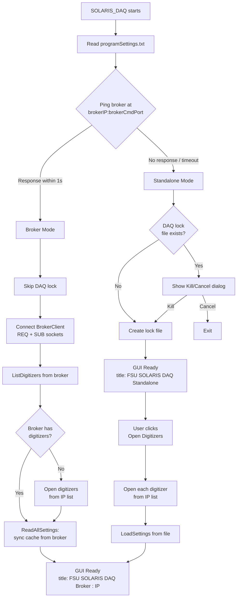
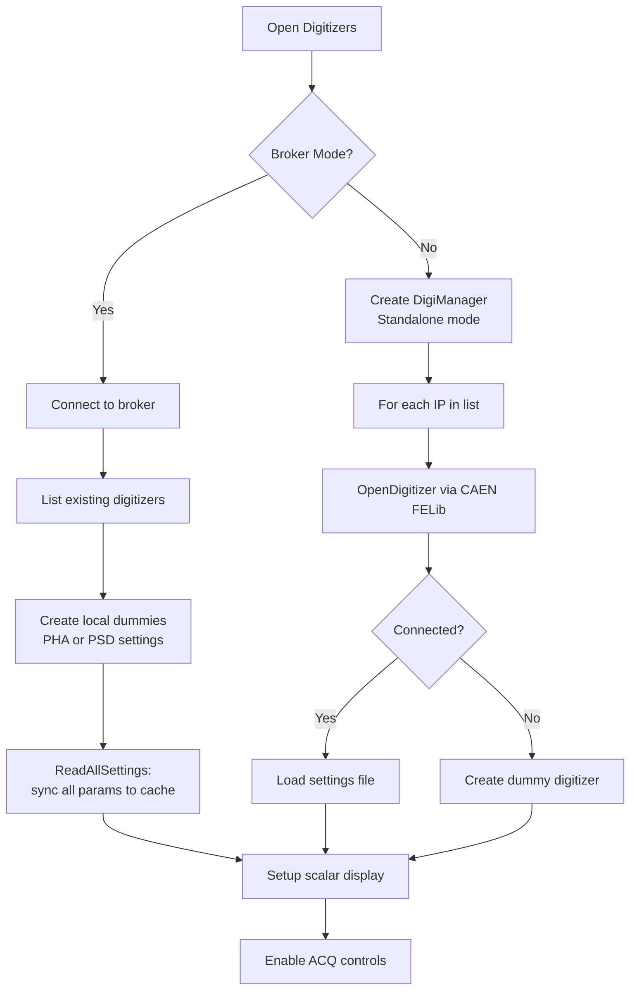
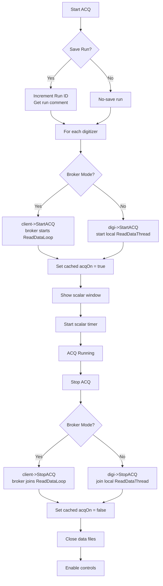
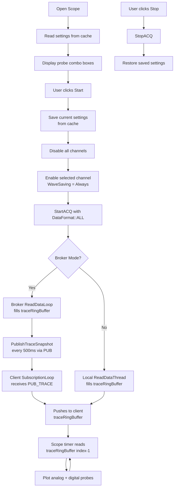
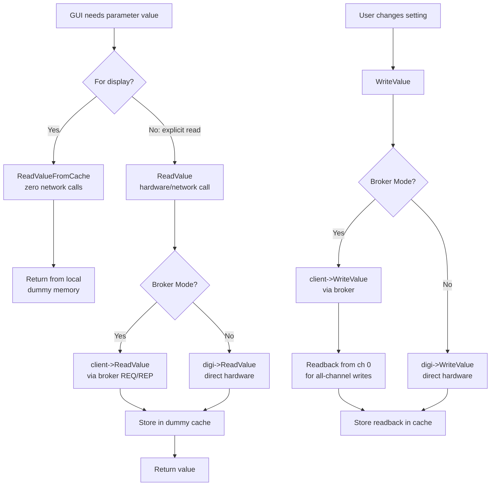
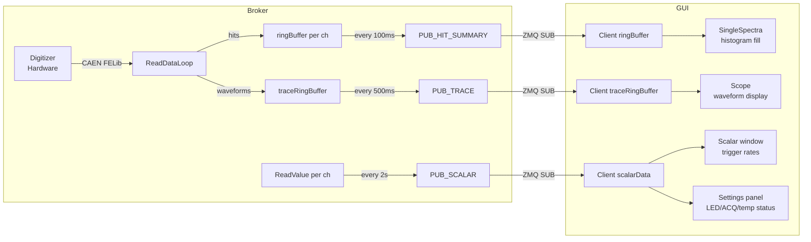
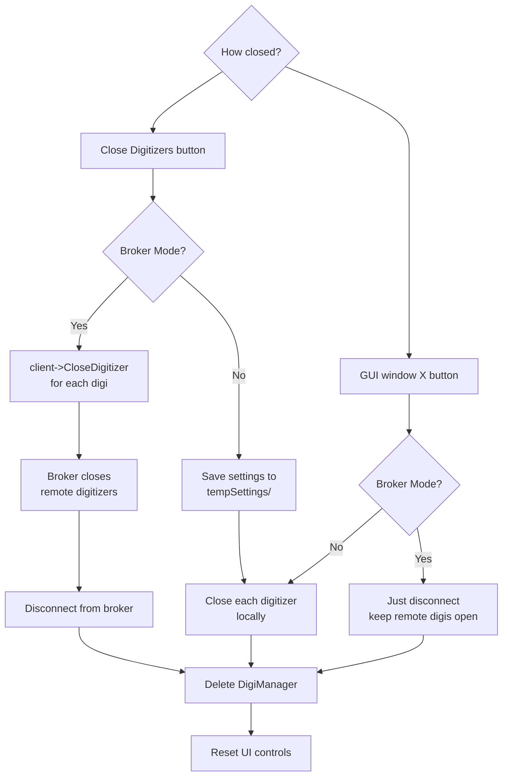

# SOLARIS DAQ

Data acquisition system for the SOLARIS (SOLenoid And Resonance Ionization Spectroscopy) detector at FRIB, using CAEN x2730 series digitizers (VX2740, VX2745, VX2730) with DPP-PHA and DPP-PSD firmware.

## Project Structure

```
SOLARIS_DAQ/
├── Makefile              # Top-level: builds GUI + broker
├── core/                 # Shared code, outside the GUI widgets
│   ├── ClassDigitizer2Gen.h/cpp   # Digitizer hardware control
│   ├── DigiManager.h/cpp          # Unified interface (standalone/broker)
│   ├── Hit.h                      # Event data structures
│   ├── RawDecoder.h               # Raw binary decoder
│   ├── RingBuffer.h               # Lock-free circular buffer
│   ├── DigiParameters.h           # Register definitions (PHA/PSD)
│   ├── ClassInfluxDB.h/cpp        # InfluxDB client
│   ├── ClassElog.h/cpp            # Wrapper around the `elog` command line client (Qt)
│   ├── ClassElogTemplate.h/cpp    # Renders the entry from `elog.template` (Qt)
│   ├── LeanHit.h                  # 16-byte timestamped hit, fed to the online builder
│   ├── BuiltHit.h                 # One hit inside a built event
│   ├── OnlineEventBuilder.h/cpp   # Merges the per-board hit rings into time-correlated events
│   ├── EventRing.h                # Buffer of built events, builder -> analysis
│   ├── Analysis.h                 # Online analysis interface + plugin ABI (Qt-free)
│   ├── AnalysisPlugin.h/cpp       # Scans and dlopen()s the analysis .so files
│   └── macro.h                    # Global constants
├── GUI/                  # Qt6 GUI application
│   ├── SOLARIS_DAQ.pro            # qmake project file
│   ├── mainwindow.h/cpp           # Main window: run control, scalars
│   ├── digiSettingsPanel.h/cpp    # Register editing panel
│   ├── scope.h/cpp                # Oscilloscope waveform display
│   ├── SingleSpectra.h/cpp        # Energy spectra histograms
│   ├── Analyzer.h/cpp             # Online analyzer: event builder, ring, worker threads
│   ├── SOLARISpanel.h/cpp         # SOLARIS detector configuration
│   └── ...                        # Custom widgets, plotting
├── broker/               # Digitizer broker (daemon + CLI)
│   ├── BrokerServer.h/cpp         # ZMQ server: manages digitizers
│   ├── BrokerClient.h/cpp         # ZMQ client library
│   ├── BrokerProtocol.h           # Binary protocol definitions
│   ├── solaris-broker.cpp         # Broker daemon entry point
│   └── solaris-cli.cpp            # Command-line interface
├── analyzers/            # Online analyses; one .cpp -> one build/<name>.so
├── docs/                 # Design documents
└── Aux/                  # Offline tools (EventBuilder, testOnlineBuilder, etc.)
```

## Operating Modes

The DAQ supports two modes, selected automatically at startup.

### Standalone Mode

The GUI directly controls the digitizers. Only one GUI instance can run (enforced by DAQ lock file).

```
SOLARIS_DAQ ──── Digitizer Hardware
```

### Broker Mode

A broker daemon (`solaris-broker`) manages the digitizers. The GUI connects over ZMQ (TCP). Multiple GUIs can connect simultaneously from any machine on the network.

```
solaris-broker ──── Digitizer Hardware
     │  (tcp://  REQ/REP commands + PUB/SUB data)
     ├── SOLARIS_DAQ (GUI instance 1, local or remote)
     ├── SOLARIS_DAQ (GUI instance 2)
     └── solaris-cli  (command-line client)
```

Note that `solaris-broker` and `SOLARIS_DAQ` speak a binary protocol with no version negotiation,
so they must be built and deployed from the same commit.

### Auto-Detection

On startup, the GUI:

1. Reads `brokerIP` and `brokerCmdPort` from `programSettings.txt`
2. Sends a ZMQ ping to `tcp://{brokerIP}:{brokerCmdPort}` (1-second timeout)
3. If the broker responds: **broker mode** — auto-connects, syncs settings, DAQ lock skipped
4. If no broker found: **standalone mode** — DAQ lock active, manual digitizer open

No manual mode toggle is needed. If the broker is running, the GUI uses it.

### GUI Startup Flow


```mermaid
flowchart TD
    A[SOLARIS_DAQ starts] --> B[Read programSettings.txt]
    B --> C{Ping broker at<br/>brokerIP:brokerCmdPort}
    C -->|Response within 1s| D[Broker Mode]
    C -->|No response / timeout| E[Standalone Mode]

    D --> F[Skip DAQ lock]
    F --> G[Connect BrokerClient<br/>REQ + SUB sockets]
    G --> H[ListDigitizers from broker]
    H --> I{Broker has<br/>digitizers?}
    I -->|Yes| K[ReadAllSettings:<br/>sync cache from broker]
    K --> L[GUI Ready<br/>title: FSU SOLARIS DAQ Broker : IP]
    I -->|No| J[Open digitizers<br/>from IP list]
    J --> K

    E --> M{DAQ lock<br/>file exists?}
    M -->|Yes| N[Show Kill/Cancel dialog]
    M -->|No| O[Create lock file]
    N -->|Kill| O
    N -->|Cancel| P[Exit]
    O --> Q[GUI Ready<br/>title: FSU SOLARIS DAQ Standalone]
    Q --> R[User clicks<br/>Open Digitizers]
    R --> S[Open each digitizer<br/>from IP list]
    S --> T[LoadSettings from file]
    T --> L
```

> **Note:** Currently, the GUI trusts whatever digitizers the broker has open. If the broker's digitizer list differs from the GUI's IP list (e.g., different digitizers, different order), the GUI does not verify or reconcile them. This may cause issues with settings files or detector mapping. This will be addressed in a future update.

### Open Digitizers Flow


```mermaid
flowchart TD
    A[Open Digitizers] --> B{Broker Mode?}

    B -->|Yes| C[Connect to broker]
    C --> D[List existing digitizers]
    D --> E[Create local dummies<br/>PHA or PSD settings]
    E --> F[ReadAllSettings:<br/>sync all params to cache]
    F --> G[Setup scalar display]

    B -->|No| H[Create DigiManager<br/>Standalone mode]
    H --> I[For each IP in list]
    I --> J[OpenDigitizer via CAEN FELib]
    J --> K{Connected?}
    K -->|Yes| L[Load settings file]
    K -->|No| M[Create dummy digitizer]
    L --> G
    M --> G

    G --> N[Enable ACQ controls]
```

### ACQ Start/Stop Flow


```mermaid
flowchart TD
    A[Start ACQ] --> B{Save Run?}
    B -->|Yes| C[Increment Run ID<br/>Get run comment]
    B -->|No| D[No-save run]
    C --> E[For each digitizer]
    D --> E

    E --> F{Broker Mode?}
    F -->|Yes| G[client->StartACQ<br/>broker starts ReadDataLoop]
    F -->|No| H[digi->StartACQ<br/>start local ReadDataThread]

    G --> I[Set cached acqOn = true]
    H --> I
    I --> J[Show scalar window]
    J --> K[Start scalar timer]
    K --> L[ACQ Running]

    L --> M[Stop ACQ]
    M --> N{Broker Mode?}
    N -->|Yes| O[client->StopACQ<br/>broker joins ReadDataLoop]
    N -->|No| P[digi->StopACQ<br/>join local ReadDataThread]
    O --> Q[Set cached acqOn = false]
    P --> Q
    Q --> R[Close data files]
    R --> S[Enable controls]
```

### Scope Flow


```mermaid
flowchart TD
    A[Open Scope] --> B[Read settings from cache]
    B --> C[Display probe combo boxes]

    C --> D[User clicks Start]
    D --> E[Save current settings<br/>from cache]
    E --> F[Disable all channels]
    F --> G[Enable selected channel<br/>WaveSaving = Always]
    G --> H[StartACQ with DataFormat::ALL]

    H --> I{Broker Mode?}
    I -->|Yes| J[Broker ReadDataLoop<br/>fills traceRingBuffer]
    J --> K[PublishTraceSnapshot<br/>every 500ms via PUB]
    K --> L[Client SubscriptionLoop<br/>receives PUB_TRACE]
    L --> M[Pushes to client<br/>traceRingBuffer]

    I -->|No| N[Local ReadDataThread<br/>fills traceRingBuffer]
    N --> M

    M --> O[Scope timer reads<br/>traceRingBuffer index-1]
    O --> P[Plot analog + digital probes]
    P --> O

    Q[User clicks Stop] --> R[StopACQ]
    R --> S[Restore saved settings]
```

### Parameter Read/Write Flow


```mermaid
flowchart TD
    A[GUI needs parameter value] --> B{For display?}

    B -->|Yes| C[ReadValueFromCache<br/>zero network calls]
    C --> D[Return from local<br/>dummy memory]

    B -->|No: explicit read| E[ReadValue<br/>hardware/network call]
    E --> F{Broker Mode?}
    F -->|Yes| G[client->ReadValue<br/>via broker REQ/REP]
    F -->|No| H[digi->ReadValue<br/>direct hardware]
    G --> I[Store in dummy cache]
    H --> I
    I --> J[Return value]

    K[User changes setting] --> L[WriteValue]
    L --> M{Broker Mode?}
    M -->|Yes| N[client->WriteValue<br/>via broker]
    N --> O[Readback from ch 0<br/>for all-channel writes]
    M -->|No| P[digi->WriteValue<br/>direct hardware]
    O --> Q[Store readback in cache]
    P --> Q
```

### Data Flow During ACQ


```mermaid
flowchart LR
    subgraph Broker
        A[Digitizer<br/>Hardware] -->|CAEN FELib| B[ReadDataLoop]
        B -->|hits| C[ringBuffer per ch]
        B -->|waveforms| D[traceRingBuffer]
        C -->|every 100ms| E[PUB_HIT_SUMMARY]
        D -->|every 500ms| F[PUB_TRACE]
        G[ReadValue per ch] -->|every 2s| H[PUB_SCALAR]
    end

    subgraph GUI
        E -->|ZMQ SUB| I[Client ringBuffer]
        F -->|ZMQ SUB| J[Client traceRingBuffer]
        H -->|ZMQ SUB| K[Client scalarData]
        I --> L[SingleSpectra<br/>histogram fill]
        J --> M[Scope<br/>waveform display]
        K --> N[Scalar window<br/>trigger rates]
        K --> O[Settings panel<br/>LED/ACQ/temp status]
    end
```

### Close Digitizers Flow


```mermaid
flowchart TD
    A{How closed?} --> B[Close Digitizers button]
    A --> C[GUI window X button]

    B --> D{Broker Mode?}
    D -->|Yes| E[client->CloseDigitizer<br/>for each digi]
    E --> F[Broker closes<br/>remote digitizers]
    F --> G[Disconnect from broker]
    D -->|No| H[Save settings to<br/>tempSettings/]
    H --> I[Close each digitizer<br/>locally]

    C --> J{Broker Mode?}
    J -->|Yes| K[Just disconnect<br/>keep remote digis open]
    J -->|No| I

    G --> L[Delete DigiManager]
    I --> L
    K --> L
    L --> M[Reset UI controls]
```

## Broker Architecture

### Broker Lifecycle

```
solaris-broker [--ip DIG_IP] [--cmd-port 5555] [--pub-port 5556]
  │
  ├─ Start(): bind ZMQ REP (commands) + PUB (broadcast) sockets
  ├─ Open digitizers from --ip argument (if provided)
  └─ Run(): enter main loop
      │
      ├─ ScalarBroadcastLoop thread (started with Run)
      │   ├─ Every 100ms: publish hit summaries (during ACQ)
      │   ├─ Every 500ms: publish trace snapshots (only when data format includes waveforms)
      │   └─ Every 2s: publish scalars + board status (LED, ACQ, temperatures)
      │
      └─ Command loop: poll ZMQ REP, dispatch commands
          ├─ open/close/list digitizers
          ├─ read/write parameters
          ├─ start/stop ACQ → spawns/joins ReadDataLoop thread per digitizer
          ├─ file control (open/close/save)
          ├─ settings management (read all/save/load)
          ├─ ping (for GUI auto-detection)
          └─ shutdown
```

### Threads

| Thread | Lifetime | Purpose |
|--------|----------|---------|
| **Main** | Process start → exit | Command polling loop (REQ/REP) |
| **ScalarBroadcastLoop** | Run() → Stop() | Publishes hit summaries (100ms), traces (500ms), and scalars (2s) via PUB socket |
| **ReadDataLoop[i]** | StartACQ → StopACQ | Reads hits from digitizer *i* into ring buffers, saves to file |

Thread safety: per-digitizer `digiMutex[i]` protects all hardware access. `ReadDataLoop` yields between reads to allow scalar broadcasts and command handlers to acquire the mutex.

### Data Flow

```
Digitizer Hardware
  │ (CAEN FELib)
  ▼
ReadDataLoop: digi->ReadData() → fills ringBuffer[ch] + traceRingBuffer
  │
  ▼
ScalarBroadcastLoop (independent timers, non-blocking):
  ├─ PUB_HIT_SUMMARY (every 100ms): new hits from ring buffers → ZMQ PUB
  ├─ PUB_TRACE (every 500ms): latest waveform snapshot → ZMQ PUB
  │     (only when data format includes waveforms: ALL or OneTrace)
  └─ PUB_SCALAR (every 2s): trigger rates, accept rates, file size,
     board status (LED, ACQ, temperatures) → ZMQ PUB
  │
  ▼ (network)
BrokerClient::SubscriptionLoop:
  ├─ Pushes hits to client-side ringBuffer[digi][ch]
  ├─ Updates scalarData[digi] (cached, mutex-protected)
  └─ Fires callbacks: onScalarUpdate, onHitSummary, onTraceSnapshot
  │
  ▼
GUI reads from cached data (zero network calls for display)
```

### Parameter Caching (DigiManager)

All GUI components read parameters from a local memory cache, not from the hardware:

| Method | What it does | When to use |
|--------|-------------|-------------|
| `ReadValue(digi, reg, ch)` | Reads from hardware/broker, **updates cache** | Explicit "Read Settings" button, write-readback |
| `ReadValueFromCache(digi, reg, ch)` | Reads from local cache only, **zero network calls** | All UI display updates |
| `WriteValue(digi, reg, val, ch)` | Writes to hardware/broker, **reads back and caches** | User changes a setting |
| `ReadAllSettings(digi)` | Reads all parameters from hardware, **populates entire cache** | On connect, "Refresh Settings" button |

In broker mode, a local dummy `Digitizer2Gen` object stores the cache. On connect, `ReadAllSettings` syncs all values from the broker to the local cache.

## Setting Up Broker Mode

1. Start the broker on the machine connected to the digitizers:
   ```bash
   ./solaris-broker --ip 192.168.0.100
   ```
   The `--ip` flag opens the digitizer immediately. Without it, use the CLI to open later.

2. Optionally use the CLI:
   ```bash
   ./solaris-cli
   > open dig2://192.168.0.100
   > lsdig
   > read 0 /par/ModelName
   ```

3. Configure the GUI's `programSettings.txt` with the broker machine's IP:
   - Line 12: `brokerIP` (default: `localhost`)
   - Line 13: `brokerCmdPort` (default: `5555`)
   - Line 14: `brokerPubPort` (default: `5556`)

4. Start the GUI:
   ```bash
   ./SOLARIS_DAQ
   ```
   It auto-detects the broker, syncs digitizer settings, and is ready to use.

Multiple GUIs on different machines can connect by setting the broker IP in their `programSettings.txt`.

### Broker Behavior

- **Window title**: shows `[Broker : IP]` or `[Standalone]` to indicate current mode
- **GUI "Close Digitizers" button**: closes remote digitizers on the broker
- **GUI window close (X button)**: just disconnects, broker keeps digitizers open
- **Broker Ctrl+C**: gracefully stops all ACQ, closes all digitizers, exits
- **Multiple GUIs**: all see the same scalar/histogram data via PUB/SUB; commands are serialized via REQ/REP
- **DAQ lock**: only active in standalone mode; skipped in broker mode (multiple GUIs allowed)

## Online Event Building

`OnlineEventBuilder` groups hits from all digitizers into time-correlated events while the run is
in progress. It is plain C++ — no Qt, no CAEN_FELib, no ROOT — so the same class can be driven from
the GUI, from a console tool replaying a file, or from a separate analyzer process.

### Data flow

```
ReadDataThread (board 0) ──> hitRing 0 ─┐
ReadDataThread (board 1) ──> hitRing 1 ─┼──> OnlineEventBuilder ──> EventRing ──> analysis
ReadDataThread (board N) ──> hitRing N ─┘     (single consumer)
```

Each digitizer owns **one** `RingBuffer<LeanHit, 262144>` — 4 MiB, roughly 262 ms of a 1 MHz board.
It is written only by that board's `ReadDataThread`, preserving the single-producer contract in
`RingBuffer.h`, and read only by the builder.

One ring per **board**, not per channel, because a board already emits all of its channels
interleaved in timestamp order (see `format_RAW.md`, Aggregate Header). Splitting per channel would
buy nothing and turn a 4-way merge into a 256-way one. `ringBuffer[]` (per-channel energies, for
`SingleSpectra`) and `traceRingBuffer` (for the scope) are unchanged and still filled alongside.

Filling the hit ring is gated by an atomic flag that is only set while the Analyzer's enable
checkbox is ticked, so when nobody is analysing the DAQ read path pays one predictable branch.

### The build horizon

The core problem: when is it safe to close an event? If you emit an event at t=500 and a slower
board then delivers its hit at t=520, you have silently turned a coincidence into two singles.

Because each board emits in non-decreasing time order, once a board has delivered a hit at time
`t` it can never deliver anything earlier. So the minimum, over boards, of *the newest timestamp
each has delivered* is a floor under every hit still to come:

```
board 0 has delivered up to  t = 1000
board 1 has delivered up to  t = 1500
board 2 has delivered up to  t =  900   <-- the slowest board sets the limit
                                  ----
                build horizon =   900
```

An event is final only once its whole window sits below the build horizon, plus `guardTime` of
margin. Two cases need care:

- **A board that has delivered nothing yet** has an *unknown* floor, not an absent one, so the
  horizon is forced to 0 and nothing is built until it speaks. Skipping such a board (as the
  offline builder can safely do, since a file with no data never gets any) lets the horizon run
  ahead and every hit that board later delivers arrives too late.
- **A board that stops delivering** would otherwise pin the horizon forever. After `stallTimeout`
  of no new data it is dropped from the minimum and building resumes. This is the one place data
  can be lost: a hit the board later delivers below an already-settled boundary is counted in
  `totalHitsLate` and discarded.

The seed hit always joins its own event; later hits join while `timestamp - eventStart <
timeWindow`. The bound is **exclusive**, matching `Aux/EventBuilder`, so the two builders agree hit
for hit. `timeWindow = 0` means no event building: one hit per event.

The merge is a linear scan over one lookahead hit per board, not a priority queue. With at most 20
boards a scan is both faster and simpler — a heap needs side state tracking which sources are
currently in it, and that state has to be re-synchronised every time a board runs dry and refills,
which online is the normal case.

### Parameters

| Setter | Default | Meaning |
|--------|---------|---------|
| `SetTimeWindow(ns)` | 100 | Hits within this of the seed join the event. Exclusive bound. 0 = one hit per event. |
| `SetGuardTime(ns)` | 1000 | Extra margin beyond the window before an event is final. Clamped to at least `timeWindow`. More margin = more latency, more tolerance to jitter between boards. |
| `SetTimeJump(ns)` | 1e8 | A hit this far *below* the previous one from the same board means the clock restarted, not corruption. |
| `SetStallTimeout(ms)` | 500 | Wall-clock, not timestamps. A board whose ring has not advanced for this long is dropped from the build horizon. Must exceed the longest gap you expect between deliveries from your slowest board. |

`Reset()` must be called on ACQ start. `StartACQ()` restarts the board timestamp counter but does
not clear the host ring, so without it the builder sees pre-reset hits with huge timestamps ahead
of new hits near zero. `BuildEvents(true)` at end of run flushes whatever is left.

### Counters

`PrintStat()` prints these, and the Analyzer window shows them. They should be zero in a healthy
run.

| Counter | Non-zero means |
|---------|----------------|
| `totalHitsDropped` | The ring lapped: the builder could not keep up, or was not called often enough. |
| `totalHitsLate` | Hits arrived below an already-settled boundary. Expected cause is a stalled board rejoining; raise `stallTimeout`. |
| `timeJumpEvents` | A board's clock restarted. Usually a missing `Reset()` on ACQ start. |
| `monotonicityViolations` | **Hits out of order within one board.** The merge assumes per-board time ordering; if this fires, the events are not trustworthy. |
| `eventsDropped` (event ring) | The analysis could not keep up — events lost, raw hits fine. This is the ring doing its job. |

### Assumptions and limits

- **Per-board timestamp ordering is load-bearing.** Documented in `format_RAW.md` and verified on
  ~23M hits of PHA / no-waveform data. Not yet verified for PSD multi-channel or the raw-blob path;
  `monotonicityViolations` is the tripwire.
- **Boards must share a clock and start together.** The builder normalises units (every timestamp
  is ns by the time it reaches the ring, scaled by that board's own `tick2ns`) but does not correct
  for a per-board time offset.
- **`EnDataReduction` firmware mode is incompatible.** Single-word events carry only a 32-bit
  reduced timestamp, which wraps every ~34 s at 8 ns/LSB, and `RawDecoder` passes it up as if it
  were the full 48-bit value.
- **`flagsHigh` is 0 in the `Minimum` and `MiniWithFineTime` formats** — those do not read the
  flags from the digitizer, so a pile-up cut would silently keep everything.
- The builder is **single-consumer**; only one thread may call `BuildEvents()` / `Reset()`.

### Testing without hardware

`Aux/testOnlineBuilder` verifies the builder with no digitizer, no Qt and no ROOT:

```bash
make -C Aux tools

./Aux/testOnlineBuilder --selftest                        # the full ladder, non-zero exit on failure
./Aux/testOnlineBuilder --synth --boards 4 --dump         # synthetic multi-board data
./Aux/testOnlineBuilder --replay run_0_51554_000.sol --window 100000000
./Aux/testOnlineBuilder --threaded --boards 4             # pushers racing the drain; run under TSan
```

`--selftest` checks the streaming output against a simple sorted-vector reference builder, checks
that the result is identical for push chunk sizes of 1 / 17 / 1000 / all-at-once (which is what
really exercises the build horizon), forces a ring lap and verifies every hit is accounted for as
either built or dropped, and confirms that a board going silent does not freeze the build.

## Online Analyzer

The Analyzer window turns built events into histograms. It owns the event builder, the event ring
and two worker threads, and an analysis is a small Qt-free class, built into its own `.so` and
loaded at runtime.

> **Standalone mode only.** The builder reads each board's in-process hit ring, which is filled by
> whichever process holds the CAEN connection. In broker mode that is the daemon, so the GUI has no
> hit data and the Analyzer button stays disabled. Run the GUI standalone to use it.

### Control model

**Nothing is tied to ACQ start/stop.** If the window is not open, no builder exists and nothing
runs. When it is open, a single checkbox enables event building and analysis together, and while
that box is unticked the digitizers do not even fill their hit rings.

Toggling off stops the builder, flushes the tail through the analysis, clears the fill flag, and
clears the event ring and every hit ring. Toggling on clears again (now provably with no producer
running), resets the builder's cursors, then starts filling. The toggle is the only run boundary,
which is why there is no epoch or generation counter anywhere.

Restarting ACQ while the toggle is on is safe: the board timestamp counter restarts, the builder
sees a large backwards jump, and the `timeJump` rule re-anchors and counts it.

### Threads

```
per-board hitRing ──> builder thread ──> EventRing ──> analysis thread ──> atomic count arrays
                      BuildEvents()                    ProcessEvent()             │
                                                                                  v
                                                              GUI thread, 2 Hz: histogram widgets
```

Two threads rather than one is what makes the ring earn its keep: if an analysis is slow, events
queue in the ring instead of the builder stalling and letting the per-board hit rings lap. Losing
events is recoverable; losing raw hits is not.

Ownership is strict, and that is what removes every lock:

| Thread | Owns |
|--------|------|
| builder | `OnlineEventBuilder` state — cursors, fronts, build horizon |
| analysis | the `EventRing::Reader`, the `Analysis` instance, its parameter variables |
| GUI | every Qt widget |

The only cross-thread paths are the lock-free `EventRing` and `Qt::BlockingQueuedConnection` calls
into the worker that owns the state. **That marshalling is the fence** — a parameter change runs on
the analysis thread between two `ProcessEvent()` calls, which is why an analysis can keep plain
`int` members with no atomics.

### Never fill a histogram from a worker thread

`Histogram1D::Fill()` assigns a `QString` into a `QCPItemText` on every call. The refcount is
atomic but the d-pointer store is not, so a worker can free the buffer the GUI thread is reading in
`draw()`. `Histogram2D::Fill()` additionally walks `cutList` while the operator may be drawing a
cut. Both are use-after-free, not cosmetic.

So the registry accumulates into plain `std::atomic<uint32_t>` arrays on the worker, and only the
GUI thread publishes them into the widgets, through `Histogram1D::SetBinContents()` and
`Histogram2D::SetCellContents()`. An analysis never sees a widget, so it cannot get this wrong.

(`SingleSpectra` still fills from its worker. That predates this and should eventually move to the
same discipline; do not copy it.)

### Writing an analysis

Drop one `.cpp` in `analyzers/` and run `make -C analyzers`. No other file changes, and no DAQ
rebuild — each analysis compiles into its own `analyzers/build/<name>.so`, which the window loads
at runtime.

```cpp
#include "../core/Analysis.h"

class MyAnalysis : public Analysis {
  int digiA = 0, chA = 0;      // plain members: the host writes them on the analysis thread
  int hE = -1, hEE = -1;
public:
  void Declare(HistRegistry & reg, const AnalysisContext & ctx) override {
    reg.ChannelParam("Channel A", &digiA, &chA);          // host builds the combo boxes
    hE  = reg.Hist1D("Energy", "E [ch]", 512, 0, 30000, /*row*/0, /*col*/0);
    hEE = reg.Hist2D("E vs E", "E(A)", "E(B)", 256, 0, 30000, 256, 0, 30000, 0, 1);
  }

  void ProcessEvent(const BuiltHit * hits, int n, HistRegistry & reg) override {
    for( int i = 0; i < n; i++ ){
      if( hits[i].digi == digiA && hits[i].channel == chA ) reg.Fill1(hE, hits[i].energy);
    }
  }
};

ANALYSIS_ENTRY(MyAnalysis, "My Analysis");
```

`ANALYSIS_ENTRY` works in both link modes: it emits the plugin's C entry points when built as a
`.so` (`-DANALYSIS_PLUGIN_BUILD`, which `analyzers/Makefile` sets), and a static registrar when
linked directly into `Aux/testOnlineBuilder`. `REGISTER_ANALYSIS` is the older spelling and is
static-only.

**One analysis per file.** The plugin entry points are `extern "C"` with fixed names, so a second
`ANALYSIS_ENTRY` in the same `.so` is a duplicate-symbol error.

`Fill1` and `Fill2` are named apart on purpose: 1D and 2D ids are separate spaces, so filling a 2D
histogram with a 1D call cannot silently land data in the wrong plot.

#### What a hit contains

`ProcessEvent` receives `n` hits **in ascending timestamp order**, so `hits[0]` is the earliest and
`hits[n-1].timestamp - hits[0].timestamp` is below the configured time window.

| `BuiltHit` field | |
|---|---|
| `timestamp` | `uint64_t`, ns |
| `fine_timestamp` | `uint16_t`, sub-tick time scaled by `tick2ns` (see `core/LeanHit.h`) |
| `energy` | `uint16_t` |
| `energy_short` | `uint16_t`, PSD only; 0 under PHA firmware |
| `sn` | `uint16_t`, board serial number |
| `digi` | `uint8_t`, the board number the GUI shows |
| `channel` | `uint8_t` |
| `flagsHigh` | `uint8_t`, quality flags — see `LeanHitFlag` in `core/LeanHit.h` |

`flagsHigh` carries `PileUp`, `EventSaturation`, `PostSaturation`, `ChargeOverflow`, `SCASelected`
and `FineTSValid`, so `if( hits[i].flagsHigh & LeanHitFlag::PileUp ) continue;` is the usual veto.
**But those bits are zero in the `Minimum` and `MiniWithFineTime` data formats** — the digitizer is
not asked for flags there — so a pile-up cut silently keeps everything. Check the data format
before relying on them.

#### What the host tells you

```cpp
struct AnalysisContext {
  int             nBoards;     // boards feeding the builder; dummies and unconnected are excluded
  const uint8_t * nChannels;   // nBoards entries; boards can differ
  uint64_t        timeWindow;  // the builder's window in ns, so dt binning can match
};
```

Note `nBoards` counts only real boards, so it is not necessarily `nDigi` — but `BuiltHit::digi` is
still the GUI's board number, so the two agree on labelling.

#### Full registry API

```cpp
int  Hist1D(name, xLabel, nBin, xMin, xMax, row, col);
int  Hist2D(name, xLabel, yLabel, nX, xMin, xMax, nY, yMin, yMax, row, col);
void Fill1(id, x);
void Fill2(id, x, y);
void ChannelParam(label, int * digi, int * channel);   // host builds two combo boxes
void BoolParam(label, bool * value);                   // host builds a checkbox
```

`row`/`col` place the plot in the window's grid. Parameters are written by the host on the analysis
thread and **the histograms are cleared whenever one changes**, so a plot never mixes counts from
two different channel selections.

Thread contract: `Declare()` runs on the GUI thread with the workers stopped (it is where widgets
get created); `ProcessEvent()`, `OnRunStart()` and `OnRunStop()` run on the analysis thread. Nothing
an analysis implements is ever entered concurrently with anything else it implements.

`analyzers/Coincidence.cpp` is the worked example: E(A) vs E(B), tB − tA, and multiplicity, with
both channels chosen at runtime.

#### Edit, rebuild and reload without restarting

The window has **Rebuild** and **Reload** buttons. Rebuild shells out to
`make -C analyzers build/<name>.so` and shows the compiler output in the log pane; if the build
fails the running analysis is left untouched, so a typo mid-run costs nothing. Reload stops both
workers, flushes, re-scans `analyzers/build/` and `dlopen`s the new `.so`.

The host refuses a `.so` whose `ANALYSIS_ABI_VERSION` does not match its own rather than crashing
in a vtable call. Bump that constant in `core/Analysis.h` whenever `Analysis`, `HistRegistry`,
`AnalysisContext` or `BuiltHit` changes shape.

An analysis references no host symbol — `Analysis` and `HistRegistry` are pure abstract, so every
call crosses a vtable. Check it stays that way with `nm -D -u analyzers/build/Coincidence.so`:
only libc / libstdc++ should appear.

#### Testing an analysis without a digitizer

An analysis can be driven over a `.sol` file or synthetic data with no hardware, no Qt and no GUI —
which also proves the registration works before you ever open the window:

```bash
make -C Aux tools

# real data
./Aux/testOnlineBuilder --replay run_0_51554_000.sol --window 100000000 \
                        --analysis "My Analysis" --chA 0 0 --chB 0 1

# synthetic two-board coincidences, when the real file has only one channel
./Aux/testOnlineBuilder --synth --boards 2 --coinc 20000 --seconds 1 --window 200 \
                        --analysis "My Analysis" --chA 0 0 --chB 1 0
```

It prints the declared histograms, the parameters, and a fill tally per histogram with means and
under/overflow counts — enough to see whether the analysis is doing what you expect.

## Build

### Prerequisites

- Ubuntu 22.04+
- Qt6: `sudo apt install qt6-base-dev libqt6charts6-dev`
- libcurl: `sudo apt install libcurl4-openssl-dev`
- libzmq: `sudo apt install libzmq3-dev`
- CAEN FELib: CAEN_FELib v1.2.2+
- CAEN Dig2: CAEN_DIG2 v1.5.3+
- libreadline: `sudo apt install libreadline-dev` (for solaris-cli)
- ROOT (for EventBuilder only)

### Compile

```bash
make          # builds GUI + broker + CLI
make gui      # GUI only
make broker   # broker + CLI only
make clean    # clean all
```

All executables are placed in the project root:
- `SOLARIS_DAQ` — GUI application
- `solaris-broker` — broker daemon
- `solaris-cli` — command-line client

### Compile the Online Analyses

Analyses are **not** linked into the GUI. Each builds into its own shared object, loaded at
runtime by the Analyzer window:

```bash
make -C analyzers                 # every analysis -> analyzers/build/*.so
make -C analyzers build/Foo.so    # just one
make -C analyzers clean
```

No Qt, CAEN or ROOT is needed, and the DAQ does not have to be rebuilt or restarted — use the
window's Rebuild / Reload buttons.

### Compile Auxiliary Tools

```bash
cd Aux/
make EventBuilder   # requires ROOT
make test           # register and raw decode tests
make tools          # testOnlineBuilder: no ROOT, no CAEN, no Qt - builds anywhere
```

### Using CAENDig2.h

```bash
cp caen_dig2-vXXXX/include/CAENDig2.h /usr/local/include/
```

## Data Formats

| Format | ID | Description |
|--------|----|-------------|
| ALL | 0x00 | All metadata + 2 analog probes + 4 digital probes |
| OneTrace | 0x01 | 1 analog probe + energy/timestamp/flags |
| NoTrace | 0x02 | Energy/timestamp/flags, no waveforms |
| Minimum | 0x03 | Channel/energy/timestamp only |
| MiniWithFineTime | 0x04 | Channel/energy/timestamp/fine_timestamp |
| Raw | 0x0A | Raw binary blob, decoded via RawDecoder |

## Program Settings

The `programSettings.txt` file stores all configuration:

```
Line  0: masterExpDataPath
Line  1: SubFolder/SingleFolder
Line  2: expName
Line  3: IPListStr (e.g., 192.168.0.100,102)
Line  4: analysisPath
Line  5: DatabaseIP
Line  6: DatabaseName
Line  7: DatabaseToken
Line  8: ElogIP
Line  9: ElogUser
Line 10: ElogPWD
Line 11: useBrokerMode (0/1, used as hint for DAQ lock; overridden by auto-detect)
Line 12: brokerIP (default: localhost)
Line 13: brokerCmdPort (default: 5555)
Line 14: brokerPubPort (default: 5556)
```

Lines 11-14 are optional. Old settings files without them use defaults (standalone mode, localhost broker).

## Supported Firmware

Tested with:
- V2745-dpp-pha-1G / V2740-dpp-pha-1G
- V2745-dpp-psd-1G / V2740-dpp-psd-1G
- VX2730 DPP-PSD (firmware 2025052203+)

## Additional Features

### Analysis Working Directory

When the analysis path is set, the DAQ will:
- Save the expName.sh
- Save digitizer settings
- Load the Mapping.h from the working directory

### End Run Script

When a run stops, the DAQ executes the bash script at `scripts/endRunScript.sh`.

### Elog Template

What the DAQ posts to the elog at the start and the stop of a run is set by `elog.template`,
in the program directory next to `programSettings.txt`. It is re-read on every start and stop,
so it can be edited while the DAQ is running. If it is missing, the DAQ writes a default one at
startup; if it is missing or broken at run time, the DAQ falls back to a built-in text and says
so in the log panel, a bad template never stops a run from being logged.

The file has two sections:

```
#=== start Run
#Subject: Run-<RunIDStr>
#Category: Run
=============== Run-<RunIDStr>
<StartTime>
comment : <StartComment>

#=== stop Run
<StopTime>
FileSize (<Bd:SN>): <Bd:FileSizeMB> MB
comment : <StopComment>
```

- Every other line starting with `#` is a comment. Use `\#` for a line that really starts with a `#`.
- `#Subject:` and `#Category:` set the elog attributes of the start-run entry.
- `<Name>` is replaced by a variable, everything else is passed through, so HTML such as
  `<br />`, `<b>bold</b>` and `<font style="color : red;">red</font> ` keeps working.
  An unknown `<Token>` is left in the entry and reported in the log panel.
- Substituted values are HTML escaped, a comment like `rate < 5 & noisy` cannot break the entry.

Lines are repeated over the digitizers:

| the line holds | it is emitted |
|------|-------------|
| `<Bd:Something>` | once per digitizer (dummies are skipped) |
| `<Bd:Ch:Something>` | once per digitizer and channel |
| `<Bd3:Something>` / `<Bd3:Ch7:Something>` | once, for that board / channel |

Inside a repeated line, `<Bd>` is the board index and `<Ch>` the channel index.

| Scope | Variables |
|------|-------------|
| Run | `<ExpName> <ElogName> <RunID> <RunIDStr> <StartTime> <StopTime> <Duration> <StartComment> <StopComment> <RunComment> <DataFormat> <AutoRun> <FilePath> <NumberOfFile> <TotalFileSize> <TotalFileSizeMB> <TotalFileSizeByte> <NumberOfBoard> <Now> <Host>` |
| Board | `<Bd:SN> <Bd:Model> <Bd:FPGAType> <Bd:FPGAVer> <Bd:NChannel> <Bd:FileSize> <Bd:FileSizeMB> <Bd:FileSizeByte> <Bd:NumberOfFile> <Bd:FileName>` |
| Channel | `<Bd:Ch:TrigRate> <Bd:Ch:AcceptRate> <Bd:Ch:SavedCount> <Bd:Ch:Realtime>` |

Any board or channel register can be used as well, under its CAEN name as saved in the
`*XSetting_*.dat` file, e.g. `<Bd:TestPulsePeriod>`, `<Bd:Ch:TriggerThreshold>`,
`<Bd:Ch:ChRecordLengthT>`. Those come from the in-memory settings cache, not from a live read
of the hardware. The rates come from the last Scaler update.

All of the above resolve in broker mode as well as standalone mode, with one caveat: the register
variables read the GUI's local settings cache, which in broker mode is filled by
`DigiManager::ReadAllSettings()`. A register never read since the GUI connected renders empty and
is reported as unresolved in the log panel.

## Known Issues

- The "Trig." Rate in the Scaler does not include the coincidence condition.
- LVDSTrgMask cannot be accessed.
- CoincidenceLengthT not loaded.
- Sometimes the digitizer halts after `/cmd/armacquisition` (CAEN library issue).
- Event/Wave trigger source cannot be set as SWTrigger.
- After CAEN_FELib v1.2.5 and CAEN_DIG2 v1.5.10, firmware before 202309XXXX not supported.

## Design documents

`docs/` holds the reasoning behind the design — why things are the way they are, rather than how to
use them. Read these before changing the threading, the settings handling or the file format.

| Document | |
|---|---|
| [docs/threading-model.md](docs/threading-model.md) | Threading and data ownership: which thread owns what, and why there are so few locks |
| [docs/online-analysis-design.md](docs/online-analysis-design.md) | Online analysis: the pipeline, the build horizon, and the alternatives that were rejected |
| [docs/run-lifecycle.md](docs/run-lifecycle.md) | The run lifecycle, start to stop |
| [docs/settings-system.md](docs/settings-system.md) | The settings system: the register cache, and when it is written through |
| [docs/sol-file-format.md](docs/sol-file-format.md) | The `.sol` file format (see also `format_RAW.md` for the CAEN aggregate layout) |
| [docs/experiment-workflow.md](docs/experiment-workflow.md) | Experiment setup: settings file, git, and the analysis folder |
| [docs/plan-dummy-generator.md](docs/plan-dummy-generator.md) | Plan (not implemented): dummy digitizers as signal generators |
| [docs/plan-broker-analysis.md](docs/plan-broker-analysis.md) | Plan (not implemented): online analysis in broker mode |

## Wiki

https://fsunuc.physics.fsu.edu/wiki/index.php/FRIB_SOLARIS_Collaboration
